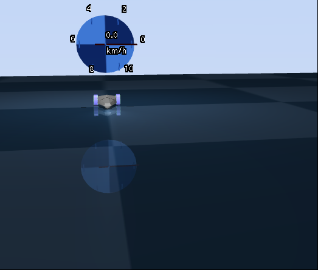
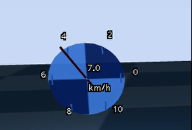

# MuJoCo MPC 汽车仪表盘 - 作业报告

---

## 一、项目概述

### 1.1 作业背景

随着智能驾驶与自动控制技术的发展，基于物理仿真的车辆控制与状态可视化成为重要的研究与教学内容。MuJoCo（Multi-Joint dynamics with Contact）是一款高性能的物理仿真引擎，广泛应用于机器人与控制领域。本作业基于 MuJoCo 与 mjpc（Model Predictive Control）框架，实现一个简化汽车模型的仪表盘系统，用于直观展示车辆运行状态。
通过本实验，学生可以加深对 MuJoCo 数据结构、物理仿真流程以及实时渲染机制的理解，并掌握仿真数据到可视化结果的完整实现流程。
---

### 1.2 实现目标

本项目的主要实现目标如下：

- 基于 MuJoCo 仿真环境搭建简化汽车场景
- 从 MuJoCo 中实时获取车辆位置、速度、加速度等状态数据
- 在仿真场景中渲染 3D 汽车仪表盘（速度表、转速表等）
- 在终端中以原地刷新的方式实时输出车辆状态信息
- 实现基于控制输入的油耗模型，并以百分比形式显示剩余油量
- 保证系统运行稳定，数据更新与渲染同步

---

### 1.3 开发环境

- 操作系统：Ubuntu 22.04.5
- 仿真引擎：MuJoCo
- 控制框架：mjpc
- 编程语言：C++
- 构建工具：CMake
- 编译器：clang12

---

## 二、技术方案

### 2.1 系统架构

#### 系统架构说明

系统整体采用“仿真 + 控制 + 可视化”三层结构：

- **仿真层**：MuJoCo 负责物理建模与动力学计算
- **控制层**：mjpc 提供模型预测控制接口
- **可视化层**：
  - 3D 场景中的仪表盘渲染（基于 mjvGeom）
  - 控制台终端文本仪表显示

#### 模块划分

- MJCF 场景描述模块
- 车辆状态获取模块
- 仪表盘渲染模块
- 终端状态输出模块
- 能耗（油量）计算模块

---

### 2.2 数据流程

#### 数据流程说明

系统中的数据流向如下：

1. MuJoCo 根据模型与控制输入计算物理状态
2. 仿真结果存储在 `mjData` 结构体中
3. 从 `mjData` 中读取车辆位置、速度、加速度等信息
4. 将数据分别传递给：
   - 3D 仪表盘渲染模块
   - 控制台终端显示模块
   - 油耗计算模块
5. 实时更新并显示结果

#### 数据结构设计

- `data->qpos`：车辆位置（广义坐标）
- `data->qvel`：车辆速度
- `data->qacc`：车辆加速度
- `data->ctrl`：控制输入（油门、转向）
- 静态变量用于累计油耗与状态统计

---

### 2.3 渲染方案

#### 渲染流程

- 使用 MuJoCo 提供的 `mjvScene` 结构
- 在 `ModifyScene()` 回调函数中动态添加几何体
- 仪表盘由多个几何体组合而成（圆环、刻度、指针、标签）

#### OpenGL 使用说明

本项目未直接调用底层 OpenGL 绘制接口，而是通过 MuJoCo 提供的高级可视化接口 `mjvGeom` 间接完成渲染。该方式可以保证渲染结果与仿真坐标系一致，简化开发流程。

---

## 三、实现细节

### 3.1 场景创建

#### MJCF 文件设计

- 使用 MJCF 描述汽车模型与环境
- 车辆由多个几何体组合而成（车身、轮子等）
- 定义必要的传感器用于速度信息获取




---

### 3.2 数据获取

#### 关键代码说明

通过 MuJoCo 的 `mjData` 结构体实时获取车辆状态：

- 位置：`data->qpos`
- 速度：`data->qvel`
- 加速度：`data->qacc`
- 车体速度：通过传感器 `car_velocity`

#### 数据验证方式

- 在终端中实时打印数值
- 观察车辆运动与数值变化是否一致
- 通过静态输出验证数据连续性与合理性

---

### 3.3 仪表盘渲染

#### 3.3.1 速度表

**实现思路**  
- 根据车辆线速度计算速度比例
- 将速度映射到 180° 的仪表盘角度范围
- 使用指针几何体表示当前速度

**代码片段**  
```
double* car_pos = data->xpos + 3 * car_body_id;
  
  // 仪表盘位置（汽车正前方，立起来）
  float dashboard_pos[3] = {
    static_cast<float>(car_pos[0]),
    static_cast<float>(car_pos[1] ),  // 汽车前方0.5米
    static_cast<float>(car_pos[2] + 0.3f)   // 地面上方0.3米
  };
  
  // 最大速度参考值（km/h），根据要求是0-10
  const float max_speed_kmh = 10.0f;
  
  // 速度百分比（0-1）
  float speed_ratio = static_cast<float>(speed_kmh) / max_speed_kmh;
  if (speed_ratio > 1.0f) speed_ratio = 1.0f;
  
  // 仪表盘旋转矩阵（绕X轴旋转90度，再顺时针旋转90度）
  double angle_x = 90.0 * 3.14159 / 180.0;  // 绕X轴旋转90度（立起来）
  double cos_x = cos(angle_x);
  double sin_x = sin(angle_x);
  double mat_x[9] = {
    1, 0,      0,
    0, cos_x, -sin_x,
    0, sin_x,  cos_x
  };
  
  double angle_z = -90.0 * 3.14159 / 180.0;  // 绕Z轴旋转-90度（顺时针）
  double cos_z = cos(angle_z);
  double sin_z = sin(angle_z);
  double mat_z[9] = {
    cos_z, -sin_z, 0,
    sin_z,  cos_z, 0,
    0,      0,     1
  };
  
  // 组合旋转矩阵：先绕X轴旋转90°，再绕Z轴顺时针旋转90°
  double dashboard_rot_mat[9];
  for (int i = 0; i < 3; i++) {
    for (int j = 0; j < 3; j++) {
      dashboard_rot_mat[i*3 + j] = 0;
      for (int k = 0; k < 3; k++) {
        dashboard_rot_mat[i*3 + j] += mat_z[i*3 + k] * mat_x[k*3 + j];
      }
    }
  }
  
  // 1. 仪表盘外圆环（完全透明，只有边框）
  if (scene->ngeom < scene->maxgeom) {
    mjvGeom* geom = scene->geoms + scene->ngeom;
    
    // 使用薄圆环作为边框
    geom->type = mjGEOM_CYLINDER;
    geom->size[0] = geom->size[1] = 0.15f;  // 外半径
    geom->size[2] = 0.002f;                 // 非常薄，看起来像线
    
    geom->pos[0] = dashboard_pos[0];
    geom->pos[1] = dashboard_pos[1];
    geom->pos[2] = dashboard_pos[2];
    
    // 应用仪表盘旋转矩阵
    for (int j = 0; j < 9; j++) {
      geom->mat[j] = static_cast<float>(dashboard_rot_mat[j]);
    }
    
    // 设置透明效果：浅灰色细线
    geom->rgba[0] = 0.7f;
    geom->rgba[1] = 0.7f;
    geom->rgba[2] = 0.7f;
    geom->rgba[3] = 0.8f;  // 稍微透明
    scene->ngeom++;
  }
  
  // 2. 添加刻度线（0, 2, 4, 6, 8, 10 共6个刻度）
  // 由于仪表盘已经顺时针旋转了90度，我们需要调整刻度的角度
  int tick_values[6] = {0, 2, 4, 6, 8, 10};
  
  // 调整后的刻度角度（考虑仪表盘已顺时针旋转90度）
  // 原来0在正上方（-90度），顺时针旋转90度后，0应该在正左方（180度）
  float tick_angles[6] = {
    180.0f,   // 0在左方（原来-90度，+90度后变为180度）
    120.0f,   // 2在左上方
    60.0f,    // 4在右上方
    0.0f,     // 6在正右方
    -60.0f,   // 8在右下方
    -120.0f   // 10在左下方
  };
  
  for (int i = 0; i < 6; i++) {
    if (scene->ngeom >= scene->maxgeom) break;
    
    float rad_tick_angle = tick_angles[i] * 3.14159f / 180.0f;
    
    // 刻度线长度（主刻度稍长）
    float tick_length = (tick_values[i] == 0 || tick_values[i] == 6 || tick_values[i] == 10) ? 0.02f : 0.015f;
    float tick_radius = 0.135f;  // 刻度起始半径
    
    mjvGeom* geom = scene->geoms + scene->ngeom;
    geom->type = mjGEOM_BOX;
    geom->size[0] = 0.003f;      // 刻度线宽度
    geom->size[1] = tick_length; // 刻度线长度
    geom->size[2] = 0.003f;      // 刻度线厚度
    
    // 刻度线位置：在圆环内侧
    // 注意：这里使用cos和sin计算位置，但坐标系已经旋转了
    float tick_y = dashboard_pos[1] - tick_radius * cos(rad_tick_angle);
    float tick_z = dashboard_pos[2] + tick_radius * sin(rad_tick_angle);
    
    geom->pos[0] = dashboard_pos[0];
    geom->pos[1] = tick_y;
    geom->pos[2] = tick_z;
    
    // 刻度线需要指向圆心，应用仪表盘旋转矩阵
    for (int j = 0; j < 9; j++) {
      geom->mat[j] = static_cast<float>(dashboard_rot_mat[j]);
    }
    
    geom->rgba[0] = 0.8f;  // 浅灰色刻度
    geom->rgba[1] = 0.8f;
    geom->rgba[2] = 0.8f;
    geom->rgba[3] = 1.0f;
    scene->ngeom++;
    
    // 添加刻度数字（标签不需要旋转，应该始终面向摄像机）
    if (scene->ngeom < scene->maxgeom) {
      mjvGeom* label_geom = scene->geoms + scene->ngeom;
      label_geom->type = mjGEOM_LABEL;
      label_geom->size[0] = label_geom->size[1] = label_geom->size[2] = 0.05f;
      
      // 数字位置在刻度线外侧稍远
      float label_radius = 0.18f;
      float label_y = dashboard_pos[1] - label_radius * cos(rad_tick_angle);
      float label_z = dashboard_pos[2] + label_radius * sin(rad_tick_angle);
      
      label_geom->pos[0] = dashboard_pos[0];
      label_geom->pos[1] = label_y;
      label_geom->pos[2] = label_z;
      
      label_geom->rgba[0] = 0.8f;  // 浅灰色数字
      label_geom->rgba[1] = 0.8f;
      label_geom->rgba[2] = 0.8f;
      label_geom->rgba[3] = 1.0f;
      
      char tick_label[10];
      std::snprintf(tick_label, sizeof(tick_label), "%d", tick_values[i]);
      std::strncpy(label_geom->label, tick_label, sizeof(label_geom->label) - 1);
      label_geom->label[sizeof(label_geom->label) - 1] = '\0';
      scene->ngeom++;
    }
  }
  
  // 3. 速度指针（改为红色）
  if (scene->ngeom < scene->maxgeom) {
    mjvGeom* geom = scene->geoms + scene->ngeom;
    geom->type = mjGEOM_BOX;
    geom->size[0] = 0.004f;   // 指针宽度
    geom->size[1] = 0.11f;    // 指针长度（略短于半径）
    geom->size[2] = 0.003f;   // 指针厚度
    
    // 计算指针角度：由于仪表盘已顺时针旋转90度，我们需要调整角度范围
    // 原来0在最上方（-90度），顺时针旋转90度后，0应该在左方（180度）
    // 原来的-90度到90度范围（180度）变为180度到0度范围
    float angle = 180.0f - 180.0f * speed_ratio;  // 180度到0度范围
    float rad_angle = angle * 3.14159f / 180.0f;
    
    // 指针位置（从圆心出发）
    float pointer_y = dashboard_pos[1] - 0.055f * cos(rad_angle);
    float pointer_z = dashboard_pos[2] + 0.055f * sin(rad_angle);
    
    geom->pos[0] = dashboard_pos[0];
    geom->pos[1] = pointer_y;
    geom->pos[2] = pointer_z;
    
    // 指针旋转：需要绕仪表盘法线旋转，然后再应用仪表盘的旋转
    // 首先，绕Z轴旋转到指针角度（相对于仪表盘）
    double pointer_angle = angle - 90.0;  // 调整方向，使指针指向正确
    double rad_pointer_angle = pointer_angle * 3.14159 / 180.0;
    double cos_p = cos(rad_pointer_angle);
    double sin_p = sin(rad_pointer_angle);
    double pointer_rot_mat[9] = {
      cos_p, -sin_p, 0,
      sin_p,  cos_p, 0,
      0,      0,     1
    };
    
    // 组合旋转：先绕Z轴旋转到指针角度，再应用仪表盘旋转
    double temp_mat[9];
    for (int i = 0; i < 3; i++) {
      for (int j = 0; j < 3; j++) {
        temp_mat[i*3 + j] = 0;
        for (int k = 0; k < 3; k++) {
          temp_mat[i*3 + j] += dashboard_rot_mat[i*3 + k] * pointer_rot_mat[k*3 + j];
        }
      }
    }
    
    for (int i = 0; i < 9; i++) {
      geom->mat[i] = static_cast<float>(temp_mat[i]);
    }
    
    // 将指针改为红色
    geom->rgba[0] = 1.0f;  // 红色
    geom->rgba[1] = 0.0f;
    geom->rgba[2] = 0.0f;
    geom->rgba[3] = 1.0f;
    scene->ngeom++;
  }
  
  // 4. 中心固定点（小圆点）
  if (scene->ngeom < scene->maxgeom) {
    mjvGeom* geom = scene->geoms + scene->ngeom;
    geom->type = mjGEOM_SPHERE;
    geom->size[0] = geom->size[1] = geom->size[2] = 0.006f;
    geom->pos[0] = dashboard_pos[0];
    geom->pos[1] = dashboard_pos[1];
    geom->pos[2] = dashboard_pos[2];
    // 应用仪表盘旋转矩阵
    for (int j = 0; j < 9; j++) {
      geom->mat[j] = static_cast<float>(dashboard_rot_mat[j]);
    }
    geom->rgba[0] = 0.8f;  // 浅灰色中心点
    geom->rgba[1] = 0.8f;
    geom->rgba[2] = 0.8f;
    geom->rgba[3] = 1.0f;
    scene->ngeom++;
  }
  
  // 5. 数字速度显示（在仪表盘中央偏上）
  if (scene->ngeom < scene->maxgeom) {
    mjvGeom* geom = scene->geoms + scene->ngeom;
    geom->type = mjGEOM_LABEL;
    geom->size[0] = geom->size[1] = geom->size[2] = 0.08f;
    geom->pos[0] = dashboard_pos[0];
    geom->pos[1] = dashboard_pos[1];
    geom->pos[2] = dashboard_pos[2] + 0.02f;  // 仪表盘中央偏上
    
    geom->rgba[0] = 0.9f;  // 浅灰色数字
    geom->rgba[1] = 0.9f;
    geom->rgba[2] = 0.9f;
    geom->rgba[3] = 1.0f;
    
    char speed_label[50];
    std::snprintf(speed_label, sizeof(speed_label), "%.1f", speed_kmh);
    std::strncpy(geom->label, speed_label, sizeof(geom->label) - 1);
    geom->label[sizeof(geom->label) - 1] = '\0';
    scene->ngeom++;
  }
  
  // 6. 添加"km/h"单位标签（在数字下方）
  if (scene->ngeom < scene->maxgeom) {
    mjvGeom* geom = scene->geoms + scene->ngeom;
    geom->type = mjGEOM_LABEL;
    geom->size[0] = geom->size[1] = geom->size[2] = 0.05f;
    geom->pos[0] = dashboard_pos[0];
    geom->pos[1] = dashboard_pos[1];
    geom->pos[2] = dashboard_pos[2] - 0.06f;  // 数字下方
    
    geom->rgba[0] = 0.8f;  // 浅灰色
    geom->rgba[1] = 0.8f;
    geom->rgba[2] = 0.8f;
    geom->rgba[3] = 1.0f;
    
    std::strncpy(geom->label, "km/h", sizeof(geom->label) - 1);
    geom->label[sizeof(geom->label) - 1] = '\0';
    scene->ngeom++;
  }
```


**效果展示**  




---

#### 3.3.2 转速表

**实现思路**  
- 使用车辆速度近似模拟发动机转速
- 将转速映射为固定长度的终端字符条（30 格）
- 使用 `#` 表示当前转速水平

**代码片段**  
const int BAR_LEN = 30;
    const double max_speed_ref = 5.0;   // 参考最大速度
    double rpm_ratio = speed_ms / max_speed_ref;
    if (rpm_ratio > 1.0) rpm_ratio = 1.0;
    if (rpm_ratio < 0.0) rpm_ratio = 0.0;

    int filled = static_cast<int>(rpm_ratio * BAR_LEN);

    char rpm_bar[BAR_LEN + 1];
    for (int i = 0; i < BAR_LEN; i++) {
        rpm_bar[i] = (i < filled) ? '#' : ' ';
    }
    rpm_bar[BAR_LEN] = '\0';

**效果展示**  


---

### 3.4 进阶功能

- 原地刷新终端输出，避免刷屏
- 油耗模型与剩余油量百分比显示
- 终端文本仪表与 3D 仪表盘数据同步

---

## 四、遇到的问题和解决方案

### 问题1

- **现象**：终端输出频繁刷屏，难以阅读  
- **原因**：每帧使用换行符输出数据  
- **解决**：使用回车符 `\r` 并强制刷新输出缓冲区，实现原地刷新

---

### 问题2

- **现象**：编译时报变量重复定义错误  
- **原因**：在同一作用域中多次定义相同变量  
- **解决**：统一变量定义位置，仅在首次使用时定义

---

## 五、测试与结果

### 5.1 功能测试

**测试用例**

- 车辆直线行驶
- 车辆加速与减速
- 控制输入为零时状态变化

**测试结果**

- 仪表盘显示与车辆运动状态一致
- 终端数据显示稳定、连续
- 油量百分比随时间合理变化

---

### 5.2 性能测试

- 仿真运行流畅，无明显卡顿
- 仪表盘渲染未对仿真性能造成明显影响
- 终端输出对帧率影响较小

---

### 5.3 效果展示

- 场景运行截图
- 仪表盘效果截图
- 演示视频链接
#### MJCF 场景展示


### 仿真效果演示视频

[点击观看演示视频](videos/demo.mp4)

---

## 六、总结与展望

### 6.1 学习收获

- 熟悉了 MuJoCo 的数据结构与仿真流程
- 掌握了仿真数据到可视化结果的完整实现方法
- 提高了对 C++ 工程结构与调试能力的理解

---

### 6.2 不足之处

- 油耗模型为简化模型，未考虑真实发动机特性
- 仪表盘样式仍较为基础
- 缺少更复杂的交互功能

---

### 6.3 未来改进方向

- 引入更真实的车辆动力学与能耗模型
- 优化仪表盘视觉效果与动画表现
- 增加数据记录与分析功能
- 扩展为多车辆或多场景仿真系统

---
